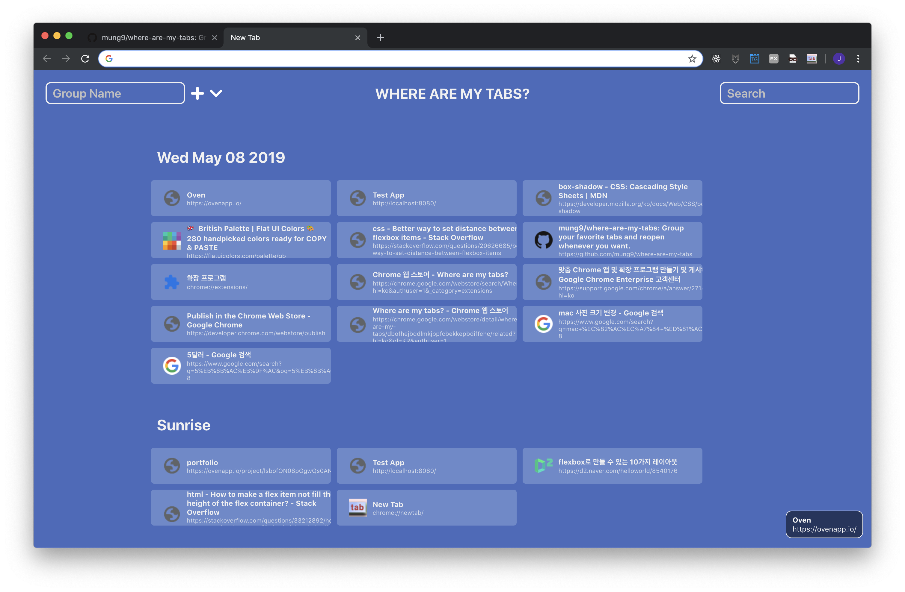

# Where are my tabs?
> google-chrome extension

구글 크롬 브라우저의 탭을 그룹 별로 묶어 나중에 다시 방문할 수 있도록 해주는 크롬 익스텐션입니다. `create-react-app`을 사용하여 개발되었습니다.

<!-- 실행 화면 캡쳐 -->
 


## 설치 및 실행

프로젝트를 원하는 디렉토리로 가져옵니다.

```shell
$ cd directory/path/you/want
$ git clone https://github.com/mung9/where-are-my-tabs
```

### 종속성 설치
프로젝트의 루트 디렉토리로 이동하여 아래 명령어를 실행합니다. 
서버 구동에 필요한 패키지들을 자동으로 설치해줍니다.
```shell
$ cd where-are-my-tabs
$ npm install
```

### 앱 실행
아래의 명령어를 입력하여 `create-react-app`의 내장 서버를 실행합니다.
```shell
$ npm start
```

설정된 브라우저가 자동으로 열리고 결과를 확인할 수 있습니다.
기본 포트번호는 3000입니다. `localhost:3000`로 접속하여 확인할 수 있습니다.

프로젝트의 루트 디렉토리로 돌아와서 아래 명령어를 입력하여 클라이언트 애플리케이션을 빌드합니다. `client/public` 디렉토리에 파일이 생성됩니다.
```shell
$ npm run client
```

실행된 애플리케이션은 구글 크롬 브라우저의 실제 데이터가 아니라, 애플리케이션 내부에서 임시로 생성된 데이터를 이용하여 서비스를 제공합니다.
실제로 크롬 브라우저의 기능을 활용하여 테스트하기 위해서는 아래 과정을 진행합니다.

### 빌드
아래 명령어를 입력하여 빌드합니다. 빌드된 파일은 루트 `build` 디렉토리에 생성됩니다.
```
$ npm run build
```

### 확장 프로그램 등록
크롬 브라우저 메뉴에서 `도구 더보기 > 확장 프로그램`으로 들어갑니다.
`개발자 모드`를 켭니다.
`압축해제된 확장 프로그램을 로드합니다.` 버튼을 클릭하여 프로젝트의 루트 디렉토리를 선택합니다.
본인의 크롬 브라우저에 개발용 확장 프로그램이 등록된 것을 확인할 수 있습니다.